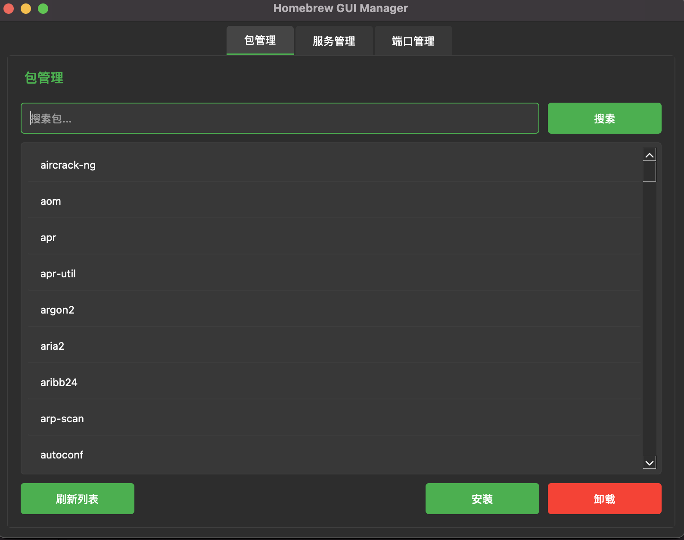

# Homebrew GUI Manager

一个现代化的 Homebrew 图形界面管理工具，基于 Python 和 PyQt6 开发。通过直观的界面轻松管理你的 Homebrew 包和服务。



## 功能特性

- **包管理**
  - 查看所有已安装的 Homebrew 包
  - 实时搜索和过滤包
  - 一键安装/卸载包
  - 支持查看包的详细信息

- **服务管理**
  - 查看所有 Homebrew 服务及其状态
  - 启动/停止/重启服务
  - 实时状态更新

- **端口监控**
  - 查看系统端口占用情况
  - 显示进程信息
  - 支持结束进程

## 系统要求

- macOS 10.13 或更高版本
- Python 3.9 或更高版本
- Homebrew 已安装

## 开发环境设置

1. 克隆仓库：
```bash
git clone git@github.com:JlSn0w/brew_gui_manager.git
cd brew_gui
```

2. 创建虚拟环境：
```bash
python3 -m venv .venv
source .venv/bin/activate
```

3. 安装依赖：
```bash
pip install PyQt6 psutil py2app
```

## 开发运行

直接运行 Python 脚本：
```bash
python main.py
```

## 打包说明

本项目使用 py2app 进行打包，生成独立的 macOS 应用程序。

1. **安装打包工具：**
```bash
pip install py2app
```

2. **配置 setup.py：**
```python
from setuptools import setup

APP = ['main.py']
OPTIONS = {
    'argv_emulation': False,
    'packages': ['PyQt6', 'psutil'],
    'includes': [
        'PyQt6.QtCore',
        'PyQt6.QtGui',
        'PyQt6.QtWidgets',
        'logging',
        'subprocess',
        'os',
        'sys',
        'shlex'
    ],
    'excludes': ['tkinter', 'matplotlib'],
    'plist': {
        'CFBundleName': 'BrewGUI',
        'CFBundleDisplayName': 'BrewGUI',
        'CFBundleGetInfoString': "Homebrew GUI Manager",
        'CFBundleIdentifier': "com.brewgui.app",
        'CFBundleVersion': "1.0.0",
        'CFBundleShortVersionString': "1.0.0",
        'NSHighResolutionCapable': 'True',
        'LSMinimumSystemVersion': '10.13',
    }
}

setup(
    name="BrewGUI",
    app=APP,
    options={'py2app': OPTIONS},
    setup_requires=['py2app'],
)
```

3. **打包命令：**

- 开发模式（用于测试）：
```bash
python setup.py py2app -A
```

- 发布模式（生成独立应用）：
```bash
python setup.py py2app
```

打包后的应用程序将位于 `dist` 目录下。

## 项目结构

```
brew_gui/
├── main.py          # 主程序入口
├── brew_manager.py  # Homebrew 管理核心类
├── setup.py        # 打包配置文件
└── README.md       # 项目文档
```

## 使用说明

1. **包管理**
   - 启动后自动显示已安装的包列表
   - 使用搜索框过滤包名
   - 选择包后可以进行安装/卸载操作
   - 点击刷新按钮更新包列表

2. **服务管理**
   - 切换到 Services 标签页查看服务
   - 选择服务后可以进行启动/停止/重启操作
   - 服务状态实时更新

3. **端口监控**
   - 切换到 Ports 标签页查看端口占用
   - 显示进程名称、PID 和端口信息
   - 可以选择进程进行终止

## 故障排除

1. **启动问题**
   - 确保已安装所有依赖
   - 检查 Python 版本是否兼容
   - 验证 Homebrew 是否正确安装

2. **权限问题**
   - 某些操作可能需要管理员权限
   - 使用 sudo 运行命令或提供必要权限

3. **打包问题**
   - 清理旧的构建文件：`rm -rf build dist`
   - 确保所有依赖都已正确安装
   - 检查 setup.py 配置是否正确

## 贡献指南

欢迎提交 Pull Requests 和 Issues！

## 许可证

MIT License